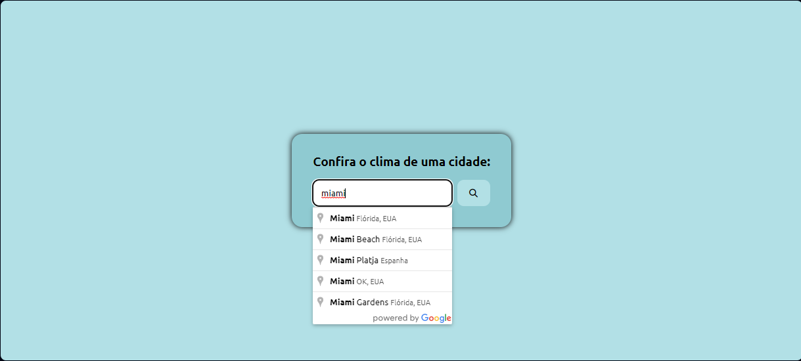
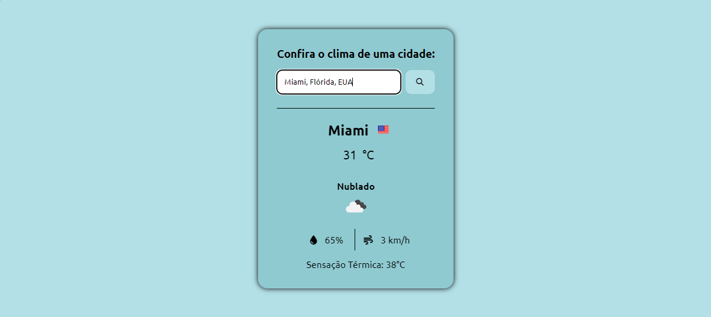

# Previsão do Tempo

## Sobre o Projeto

https://isac14.github.io/Previsao-do-Tempo/

Este projeto é um sistema que permite verificar a previsão do tempo de qualquer lugar do globo 🌎.

Ele foi feito utilizando as linguagens de marcação HTML e CSS, e a linguage de programação JavaScript.

Para o seu funcionamento, foi utilizada a API da "Open Weather Map" para o fornecimento de dados e a API do "Google Maps" para a funcionalidade do autocomplete no campo de busca.

## Galeria

# Autor

Isac Mamede Pereira Santos

https://www.linkedin.com/in/isac-mamede/
